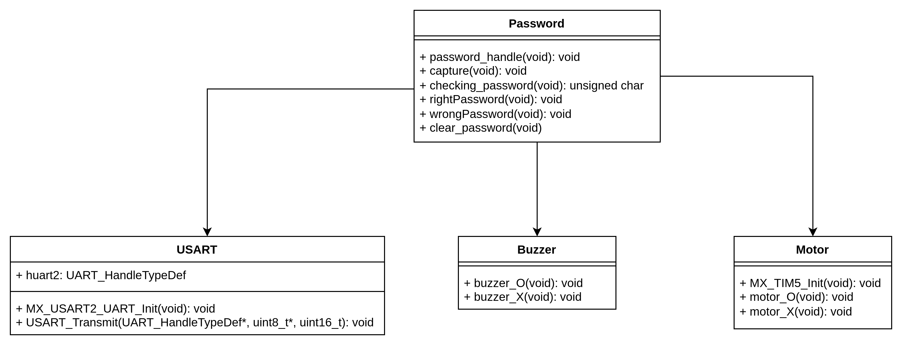
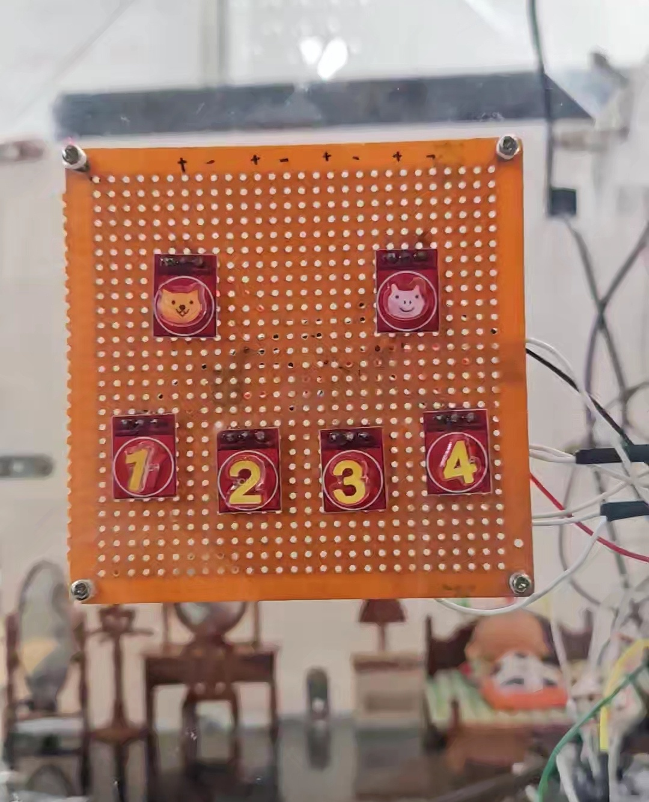
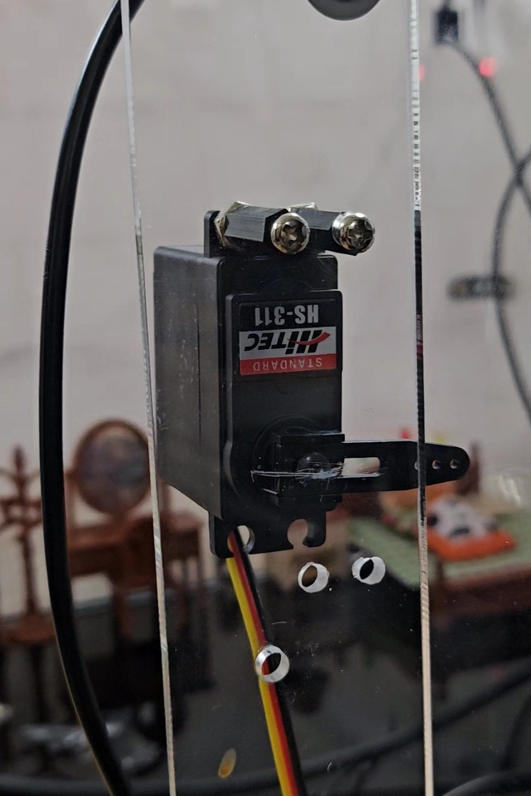

# DoorLock
## Table of contents
1. [Hardware](#hardware)  
2. [Schematic](#schematickicad)  
3. [Flow Chart](#flow-chart)  
4. [Function Structure](#function-structure)
5. [Motor](#motor) 
6. [Touchpad](#touchpad)
7. [USART](#raspberrypi와-mcu의-usart-통신)  
8. [DoorLock Photo](#doorlock-photo)  
<br><br>

  
## Hardware
- NUCLEO-F767ZI (ARM Cortex-M7)
- SY-LD221 (터치 센서)
- HS-311 (서보 모터)
- ELB030300 (부저)  
<br>

## Schematic(KiCad)
  
<br>
  
## Flow Chart
  
<br>

## Function Structure
  
<br><br>

## Motor
### Timer 사용하여 motor PWM(Pulse Width Modulation) 생성 (CubeIDE 함수 사용)
```
/*  HAL(Hardware Abstraction Layer) functions related to timers in the STM32F7 series  */
#include "stm32f7xx_hal_tim.h"

/* define Handler structure managing Motor Timer */
extern TIM_HandleTypeDef htim5;	
```
```
/* Timer Init */
void MX_TIM5_Init(void){
  TIM_MasterConfigTypeDef sMasterConfig = {0};
  TIM_OC_InitTypeDef sConfigOC = {0};
  
  htim5.Instance = TIM5;
  htim5.Init.Prescaler = 900-1;
  htim5.Init.CounterMode = TIM_COUNTERMODE_UP;
  htim5.Init.Period = 1000-1;
  htim5.Init.ClockDivision = TIM_CLOCKDIVISION_DIV1;
  htim5.Init.AutoReloadPreload = TIM_AUTORELOAD_PRELOAD_DISABLE;
  if (HAL_TIM_PWM_Init(&htim5) != HAL_OK)
  {
    Error_Handler();
  }
  sMasterConfig.MasterOutputTrigger = TIM_TRGO_RESET;
  sMasterConfig.MasterSlaveMode = TIM_MASTERSLAVEMODE_DISABLE;
  if (HAL_TIMEx_MasterConfigSynchronization(&htim5, &sMasterConfig) != HAL_OK)
  {
    Error_Handler();
  }
  sConfigOC.OCMode = TIM_OCMODE_PWM1;
  sConfigOC.Pulse = 0;
  sConfigOC.OCPolarity = TIM_OCPOLARITY_HIGH;
  sConfigOC.OCFastMode = TIM_OCFAST_DISABLE;
  if (HAL_TIM_PWM_ConfigChannel(&htim5, &sConfigOC, TIM_CHANNEL_1) != HAL_OK)
  {
    Error_Handler();
  }
  HAL_TIM_MspPostInit(&htim5);
}
```
- TIM_HandleTypeDef은 STM32에서 타이머(TIM)를 관리하기 위한 핸들러 구조체.  
HAL (Hardware Abstraction Layer) 라이브러리에서 사용되며,
 타이머를 초기화하고 제어하는 데 필요한 정보와 기능을 제공함.  
 PWM (펄스 폭 변조) 신호를 생성하고 관리하는 데 중요한 역할.  
 - TIM_HandleTypeDef 구조체의 주요 멤버들:  
 	- Instance: 사용할 타이머 인스턴스를 가리킨다.
 	- Init: 타이머 초기화 구성 정보를 포함한다.
 	- Lock: 동시에 여러 함수가 접근하지 못하도록 보호하기 위한 Lock 변수.
 	- State: 타이머의 현재 상태를 나타낸다.

### motor 동작 함수
```
/* right password motor(+90 -> +0) */
void motor_O(void){
	HAL_TIM_PWM_Start(&htim5, TIM_CHANNEL_1);
	htim5.Instance->CCR1 = 75;		// motor +90도 회전
	HAL_Delay(3500);				      // 3.5초 후
	htim5.Instance->CCR1 = 30;		// motor 0도 회전(원위치)
	HAL_Delay(2000);
	HAL_TIM_PWM_Stop(&htim5, TIM_CHANNEL_1);
}
```
<br><br>  
  
## Touchpad
### External Interrupt (CubeIDE 함수 사용)
- start touchpad(PA3), check touchpad(PA4) 예시
```
static void MX_GPIO_Init(void)
{
  /*Configure GPIO pins : PA3 PA4 */
  GPIO_InitStruct.Pin = GPIO_PIN_3|GPIO_PIN_4;
  GPIO_InitStruct.Mode = GPIO_MODE_IT_RISING;
  GPIO_InitStruct.Pull = GPIO_NOPULL;
  HAL_GPIO_Init(GPIOA, &GPIO_InitStruct);

    /* EXTI interrupt init*/
  HAL_NVIC_SetPriority(EXTI3_IRQn, 0, 0);
  HAL_NVIC_EnableIRQ(EXTI3_IRQn);

  HAL_NVIC_SetPriority(EXTI4_IRQn, 0, 0);
  HAL_NVIC_EnableIRQ(EXTI4_IRQn);
}
  ```
```		  
// touchpad(start, check) port define	
#define GPIO_check       GPIOA
#define GPIO_start_pin   GPIO_PIN_3 
#define GPIO_check_pin   GPIO_PIN_4
```
### External Interrupt Callback Function (CubeIDE 함수 사용)
```
void HAL_GPIO_EXTI_Callback(uint16_t GPIO_PIN){ 
	if (GPIO_PIN == GPIO_start_pin)
     	doorlock_status = PREPARE_INPUT;		    // start touch
	if (GPIO_PIN == GPIO_check_pin)
    		doorlock_status = CHECKING_PASSWORD;    // finish touch
}
```
- GPIO(General Purpose Input/Output) 인터럽트의 콜백 함수  
이 함수는 GPIO 핀의 외부 인터럽트(EXTI)가 발생할 때 호출됨.  
일반적으로 인터럽트 핸들러(GPIO 핀의 상태 변화를 감지, 필요한 작업을 수행)로 사용.  
GPIO_PIN은 인터럽트가 발생한 GPIO 핀을 식별하는데 사용됨  
<br><br>

## RaspberryPi와 MCU의 USART 통신
### USART Init  (CubeIDE 함수 사용)
```
/*  HAL(Hardware Abstraction Layer) functions related to timers in the STM32F7 series */
#include "stm32f7xx_hal_uart.h"

UART_HandleTypeDef huart2;       // USART_B handler
```
```
/* USART_B init */
void MX_USART2_UART_Init(void)
{
  huart2.Instance = USART2;
  huart2.Init.BaudRate = 9600;
  huart2.Init.WordLength = UART_WORDLENGTH_8B;
  huart2.Init.StopBits = UART_STOPBITS_1;
  huart2.Init.Parity = UART_PARITY_NONE;
  huart2.Init.Mode = UART_MODE_TX_RX;
  huart2.Init.HwFlowCtl = UART_HWCONTROL_NONE;
  huart2.Init.OverSampling = UART_OVERSAMPLING_16;
  huart2.Init.OneBitSampling = UART_ONE_BIT_SAMPLE_DISABLE;
  huart2.AdvancedInit.AdvFeatureInit = UART_ADVFEATURE_NO_INIT;
  if (HAL_UART_Init(&huart2) != HAL_OK)
  {
    Error_Handler();
  }
}
```
### USART TX 동작
```
/* Data Transmit(TX) */
HAL_USART_Transmit(&huart2, &data, size, HAL_MAX_DELAY);
```
<br><br>

## DoorLock Photo
  
  