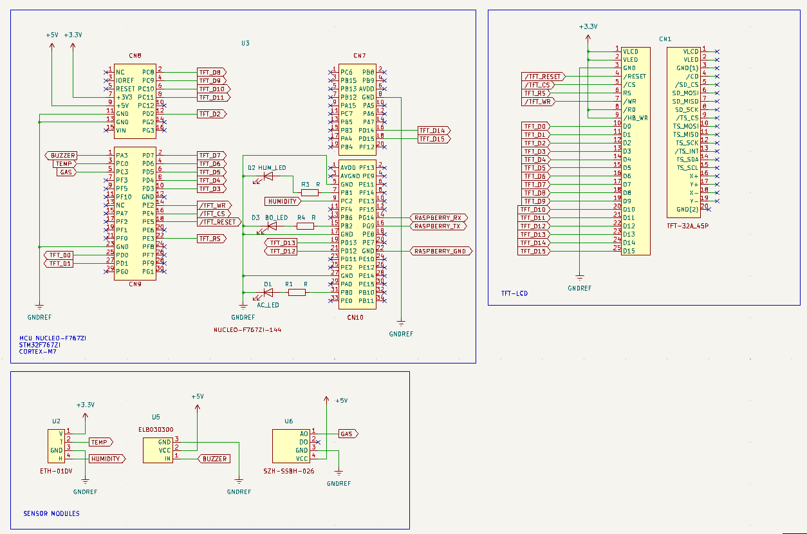
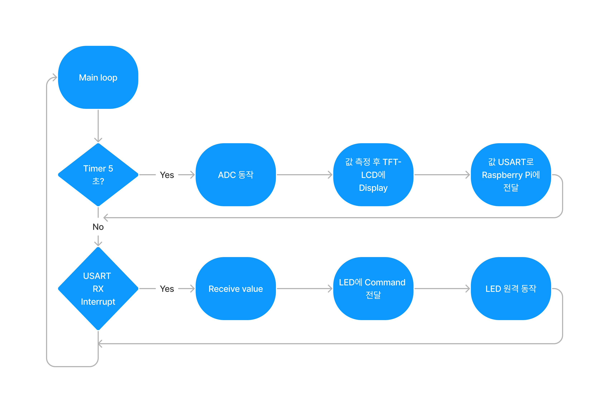
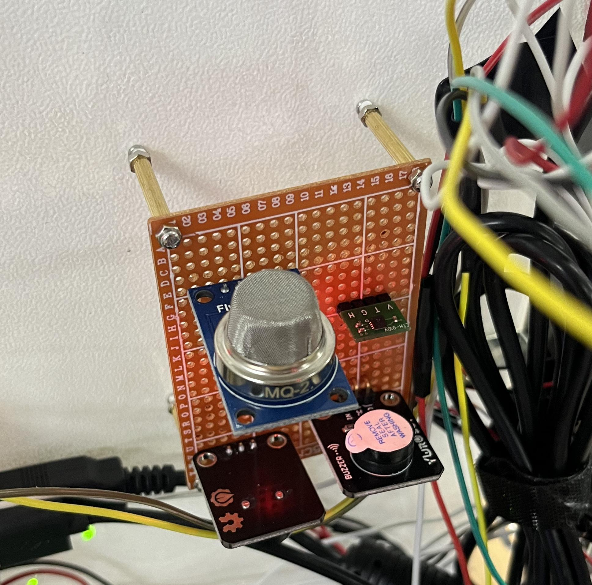
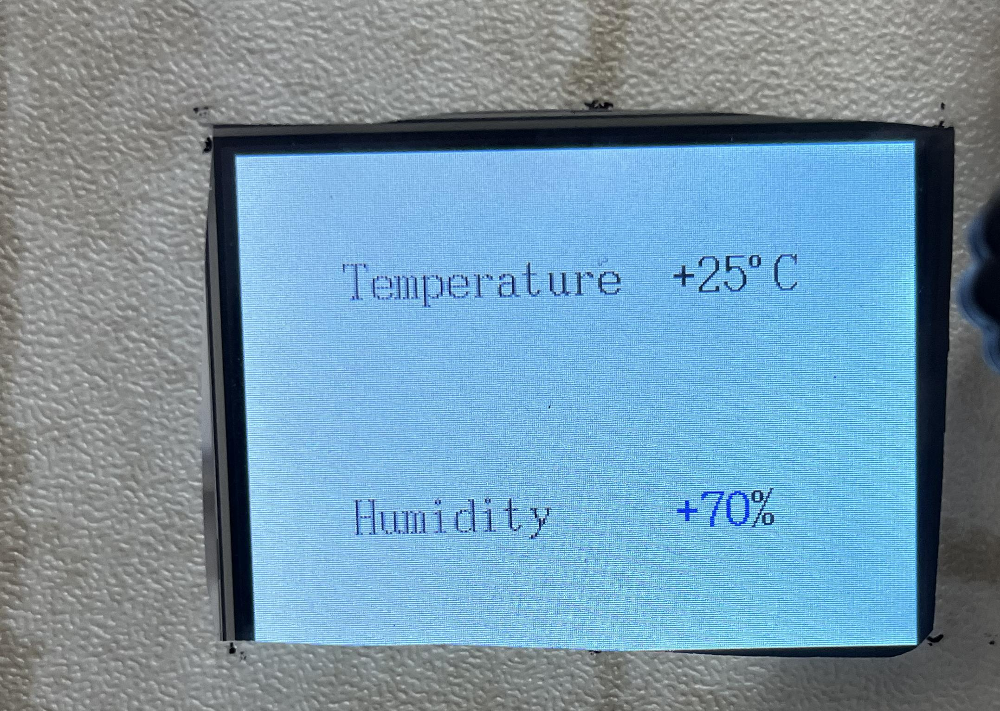

# IoT-project

### Table of contents
1. [Hardware](#hardware)
2. [Schematic](#schematickicad)
3. [ADC를 활용한 온도, 습도, 가스 센서 제어](#adc를-활용한-온도-습도-가스센서-제어)
4. [TFT-LCD](#tft-lcd)
5. [USART](#raspberry-pi와-usart-통신)
6. [Timer](#timer를-사용한-5초마다-adc-작동)

## Hardware
- NUCLEO-F767ZI (ARM Cortex-M7)
- ETH-01DV (온습도 센서)
- HX8347-A (TFT-LCD 3.2inch)
- SZH-SSBH-026 (가스 센서)
- ELB030300 (부저)

## Schematic(KiCad)


## 간단한 흐름도



## ADC를 활용한 온도, 습도, 가스센서 제어

### 사진



### ADC 초기화

  ```C
    GPIOC->MODER |= 0x000000F3;	// PC0, PC2, PC3 Analog mode
    RCC->APB2ENR |= 0x00000100;	// ADC1 Enable

    ADC->CCR = 0x00010000;

    ADC1->SMPR1 = 0x000006C3;	// CHANNEL 10, 12, 13 = 56 CYCLE
    ADC1->SMPR2 = 0x00000000;

    ADC1->CR1 = 0x00000900;		// 12-BIT RESOLUTION, SET SCAN
    ADC1->CR2 = 0x00000401;		// SET EOCS, CONT, ADON

    ADC1->SQR1 = 0x00200000;	// REGULAR CHANNEL SEQUENCE LENGTH = 3
    ADC1->SQR2 = 0x00000000;
    ADC1->SQR3 = 0x0000358A;	// CH 10 -> 12 -> 13
  ```

### ADC 값 읽기 및 변환

  ```C
  // TEMPERATURE
	ADC1->CR2 |= 0x40000000;

	while(!(ADC1->SR & 0x00000002));
	adc1_channel10_result = ADC1->DR;

	float temperature = ((float)adc1_channel10_result * 217.75 / 4095.) - 66.875;

  // Display at TFT-LCD ...

	// HUMIDITY
	ADC1->CR2 |= 0x40000000;

	while(!(ADC1->SR & 0x00000002));
	adc1_channel12_result = ADC1->DR;
	float humidity = ((float)adc1_channel12_result *100. / 4095.);

  // Display at TFT-LCD ...

	// GAS SENSOR
	ADC1->CR2 |= 0x40000000;

	while(!(ADC1->SR & 0x00000002));
	adc1_channel13_result = ADC1->DR;

	unsigned int ppm = adc1_channel13_result;
  ```

## TFT-LCD

### 사진



### TFT-LCD 초기화

```C
  RCC->AHB1ENR |= 0x00000018;
  GPIOC->ODR = 0x00000000;
  GPIOC->OSPEEDR = 0x00550000;

  GPIOD->ODR = 0x00000000;
  GPIOD->OSPEEDR = 0x55005555;

  GPIOE->MODER &= 0xFFFFF00F;
  GPIOE->MODER |= 0x00000550;
  GPIOE->ODR |= 0x00000034;
  GPIOE->OSPEEDR &= 0xFFFF00F;
  GPIOE->OSPEEDR |= 0x00000550;

  GPIOE->BSRR = 0x00200000;
  Delay_ms(1);
  GPIOE->BSRR = 0x00000020;
  Delay_ms(120);

  TFT_LCD_Write(0x02, 0x0000); // window setting
  TFT_LCD_Write(0x03, 0x0000); // x = 0~319
  TFT_LCD_Write(0x04, 0x0001);
  TFT_LCD_Write(0x05, 0x003F);
  TFT_LCD_Write(0x06, 0x0000); // y = 0~239
  // ...
  // TFT-LCD 초기화 설정 코드
  // ...
```

## Raspberry Pi와 USART 통신

### 사진


### USART 초기화

```C
	// USART6
	// PG14 -USART6 TX
	// PG9 - USART6 RX
	RCC->AHB1ENR |= 0x00000040;	//	GPIOG CLK ENABLE
	RCC->APB2ENR |= 0x00000020;	// USART6 CLK ENABLE

	GPIOG->MODER &= 0xCFF3FFFF;
	GPIOG->MODER |= 0x20080000;	// PG14, PG9 - ALTERNATE MODE
	GPIOG->AFR[1] = 0x08000080;	// AF8
	GPIOG->AFR[0] = 0x00000000;

	USART6->CR1 |= USART_CR1_RE | USART_CR1_TE | USART_CR1_UE;
	USART6->CR1 |= USART_CR1_RXNEIE;
	USART6->CR2 = 0x00000000;
	USART6->CR3 = 0x00000000;
	USART6->BRR = 2813;

	Delay_ms(1);

	RXD = USART6->RDR;

	NVIC->ISER[2] = 0x00000080;	// SET RECEIVE INTERRUPT
```

### USART TX

```C
void USART6_char(unsigned char data)
{
	// Check TXE
	while(!(USART6->ISR & 0x00000080));
	USART6->TDR = data;
}

void USART6_string(char* string, unsigned int size)
{
	unsigned int i = 0;
	for(i = 0; i < size; ++i)
	{
		if(string[i] == '\0')
			break;
		USART6_char(string[i]);
	}
}

```

### USART RX

```C
void USART6_IRQHandler(void)
{
	if (USART6->ISR & USART_ISR_RXNE)
	{
		RXD = USART6->RDR;

		if((RXD >= 0x20) && (RXD <= 0x7F))
		{
			rx_flag = 1;
			command = RXD;
		}
	}
}
```

## TIMER를 사용한 5초마다 ADC 작동

### TIMER 초기화

```C
	RCC->APB2ENR |= 0x00000001;
	TIM1->PSC = 959;
	TIM1->ARR = 49999;
	TIM1->CNT = 0;
	TIM1->DIER = 0x0001;
	TIM1->CR1 = 0x0005;
	NVIC->ISER[0] |= 0x02000000;
```

### TIMER INTERRUPT

```C
void TIM1_UP_TIM10_IRQHandler(void)
{
	TIM1->SR = 0x0000;
	interrupt_flag = 1;
	interrupt_count++;

	if ((interrupt_count % 10) == 0)
		adc_flag = 1;
}
```
