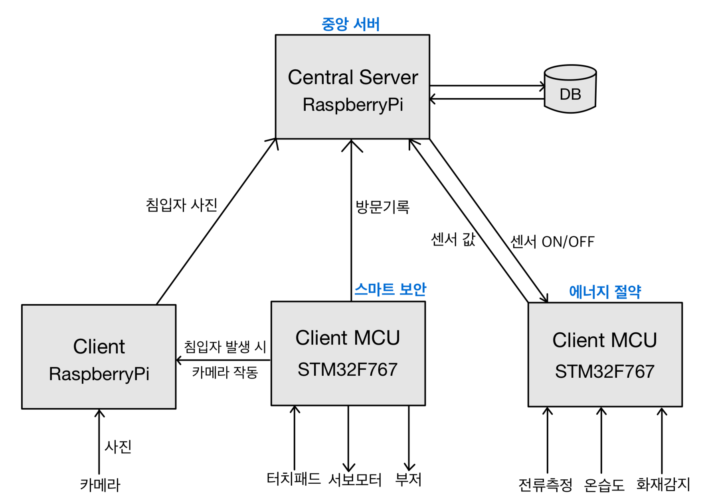

# IoT Project
## 시작: 문제 인식과 동기

✨**배경**:
수업 시간 보게된 스마트홈 관련 영상에서 관심을 가지게 됨.
현대 사회에서 스마트 홈 기술이 빠르게 발전하고 있음에도 불구하고, 많은 가정에서는 여전히 보안과 환경 관리를 위한 효율적이고 사용자 친화적인 시스템이 부족함.  
✨**문제**: 집안의 보안을 강화하고, 동시에 생활 환경을 자동으로 조절할 수 있는 통합 시스템의 부재.  
✨**동기**: 사용자가 외출 중일지라도 집안의 보안을 실시간으로 모니터링하고, 최적의 생활 환경을 자동으로 유지할 수 있는 스마트 홈 시스템의 필요성을 인식하게 됨.  
✨**개발**: 아이디어 구체화와 팀 구성  
✨**아이디어**: 라즈베리 파이와 ATmega128, Cortex -M7 중심으로 보안 및 환경 관리 기능을 통합한 스마트 홈 시스템을 개발하기로 함.  
✨**팀 구성**: 다양한 배경을 가진 학생들로 구성된 팀을 모집하여, 각자의 전문성을 바탕으로 역할을 분담. 하드웨어 설계, 소프트웨어 개발, 사용자 인터페이스 디자인 등 각 분야에서 협력.  

# High Level Design


# Clone code  
```
git clone https://github.com/One-year-apart-ZIP/IoT-project.git
```

#  Prerequite
(프로잭트를 실행하기 위해 필요한 dependencies 및 configuration들이 있다면, 설치 및 설정 방법에 대해 기술) 
```
python -m venv .venv
source .venv/bin/activate
pip install -r requirements.txt
```

# Steps to build
(프로젝트를 실행을 위해 빌드 절차 기술)
```
cd ~/xxxx
source .venv/bin/activate

make
make install  
```


# Steps to run
(프로젝트 실행방법에 대해서 기술, 특별한 사용방법이 있다면 같이 기술)
```
cd ~/xxxx
source .venv/bin/activate

cd /path/to/repo/xxx/
python demo.py -i xxx -m yyy -d zzz  
```

# Output
(프로젝트 실행 화면 캡쳐)
./result.jpg

# Appendix
(참고 자료 및 알아두어야할 사항들 기술)
